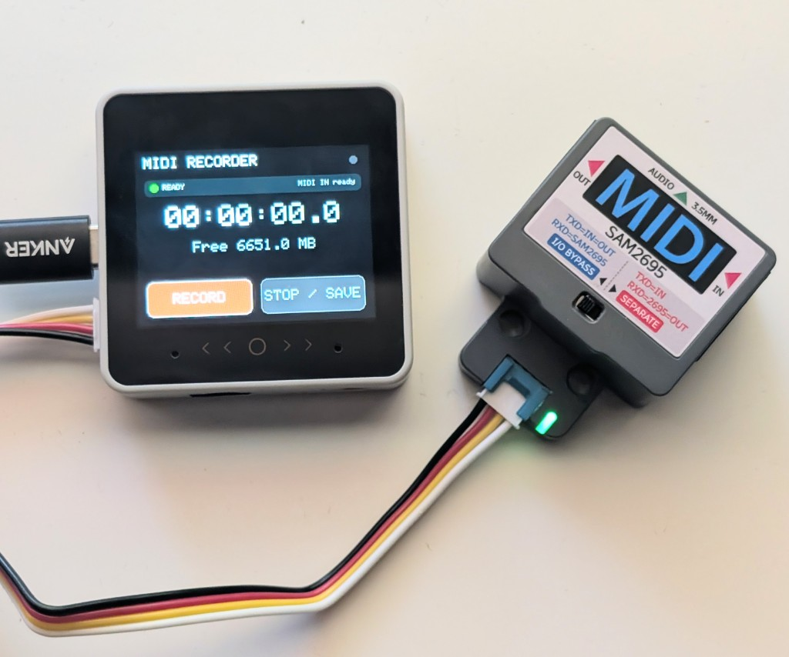

# CoreS3 MIDI Recorder

A standalone, touchscreen MIDI recorder for the **M5Stack CoreS3** and
**M5Stack Unit MIDI (U187)**. It records the Unit's DIN MIDI input to standard
format-0 `.MID` files on the CoreS3 microSD card.



The recorder is transport-armed: tapping `RECORD` prepares the file, but the
timeline stays at `00:00:00.0` until the sequencer sends MIDI Start (`FA`) or
Continue (`FB`). This gives the MIDI file a clean time-zero at sequencer PLAY.

## Controls

The CoreS3 display is a touchscreen; this app deliberately leaves the physical
power button out of the recording workflow.

- `RECORD`: arms a new recording and waits for sequencer PLAY.
- `CANCEL`: closes and removes an armed file if PLAY has not arrived.
- `STOP / SAVE`: finalizes the running recording.
- The cyan dot in the upper-right flashes when MIDI messages arrive.

While recording, the display shows elapsed `HH:MM:SS.t`, the captured-event count,
and any parser or input-overflow warnings. Files are placed in `/MIDI` as
`REC0001.MID`, `REC0002.MID`, and so on; existing files are never overwritten.

## Parts list

Prices below are approximate retail as of September 2026; shipping and tax are
extra. You will also need a FAT32 microSD card (M5Stack recommends up to 16 GB
for the CoreS3 slot).

### This build

| Part | Link | Price |
| --- | --- | --- |
| M5Stack CoreS3 (K128) | [shop.m5stack.com](https://shop.m5stack.com/products/m5stack-cores3-esp32s3-iotdevelopment-kit) | $59.90 |
| M5Stack Unit MIDI (U187) | [shop.m5stack.com](https://shop.m5stack.com/products/midi-unit-with-din-connector-sam2695) | $14.50 |
| **Total** | | **$74.40** |

### Cost comparison

| Approach | Approx. cost |
| --- | --- |
| Bare ESP32 + DIY MIDI DIN (no touchscreen) | **~$25–$35** |
| **This build (CoreS3 + Unit MIDI)** | **$74.40** |
| Commercial standalone MIDI recorder | **~$185–$470** |

**Bare ESP32 path (~$25–$35):** an
[ESP32-S3 DevKit](https://www.digikey.com/en/products/detail/espressif-systems/ESP32-S3-DEVKITC-1-N8R8/15295894)
(~$15), a hardwired 5-pin DIN MIDI IN (jack + 6N138 optocoupler + a few
passives), and a [microSD breakout](https://www.adafruit.com/product/254)
(~$7.50) if you still want on-card `.MID` files. No touchscreen — arm/stop via
serial or buttons, and this firmware’s UI would need reworking.

**Commercial standalones (~$185–$470):** purpose-built boxes such as
[Jamcorder](https://www.jamcorder.com/) (~$185–$249) or the multitrack
[Retrokits RK-008](https://retrokits.com/shop/rk008/) (~$470).

The DIY path is cheapest if you are happy soldering and living without a
screen. This M5Stack kit sits in the middle: still under $80, with a finished
touch UI and no custom MIDI wiring. Commercial recorders cost several times
more and add features (auto-capture, multitrack editing, polish) this project
does not attempt.

## Hardware setup

1. Insert a FAT32-formatted microSD card. M5Stack specifies up to 16 GB for the
   CoreS3 card slot.
2. Connect Unit MIDI to CoreS3 **Port C**. The firmware uses CoreS3 RX GPIO 18,
   TX GPIO 17, at the MIDI-standard 31,250 baud.
3. Connect the sequencer (or MIDI router) recorder feed to the Unit's MIDI **IN**.
4. Set the Unit switch to **`BYPASS`**. The
   [official Unit MIDI page](https://docs.m5stack.com/en/unit/Unit-MIDI) confirms
   that BYPASS presents MIDI IN to the CoreS3's RX pin. It also creates a
   hardware MIDI THRU path to the Unit's OUT jack, so leave OUT disconnected if
   you do not need it. The firmware never echoes input to output, so it will not
   create a second software copy.

CoreS3 has a 320×240 capacitive touchscreen and built-in microSD, as documented
on the [official CoreS3 page](https://docs.m5stack.com/en/core/CoreS3). M5Stack's
[Unit MIDI tutorial](https://docs.m5stack.com/en/arduino/projects/unit/unit_midi)
confirms the GPIO 18/17 UART mapping and 31,250 baud connection.

## Sequencer setup

Any sequencer that can send MIDI Start / Continue will arm the timeline. Turn on
transport (and any note/CC) output toward the Unit MIDI IN.

Example for Elektron Digitakt II:

1. Open `SETTINGS > MIDI CONFIG > SYNC` and turn `TRANSPORT SEND` on.
2. Open `SETTINGS > MIDI CONFIG > PORT CONFIG`.
3. Set `OUT PORT FUNCTIONALITY` to `MIDI`.
4. Set `OUTPUT TO` to `MIDI` or `MIDI+USB`.

`CLOCK SEND` is optional for this version. The incoming transport message starts
the recorder, while event times come from the CoreS3's monotonic microsecond
clock. Digitakt II menu names are from the
[Digitakt II user manual](https://www.elektron.se/wp-content/uploads/2025/06/Digitakt-2-User-Manual_ENG_OS1.15_250625.pdf).

## Record a take

1. Power on the CoreS3 and wait for `READY`.
2. Tap `RECORD`. The screen changes to `ARMED` and says `Waiting for sequencer
   PLAY`.
3. Press PLAY on the sequencer. The state changes to `RECORDING` and the duration
   begins at zero.
4. Tap `STOP / SAVE` when the take is finished. Wait for `SAVED` before removing
   the card or switching off the CoreS3.

MIDI Stop (`FC`) does not save or close the file in this version. After stopping
the sequencer, use the touchscreen's `STOP / SAVE` button so an accidental
transport stop cannot end the take.

If PLAY does nothing, check that transport send is enabled, verify that the
sequencer/router path reaches Unit MIDI IN, and look for the cyan MIDI activity
dot.

## Build and upload

The project uses PlatformIO and pins the same ESP32 platform family recommended
by M5Stack for CoreS3.

```sh
pio run
pio run --target upload
pio device monitor
```

Or open this directory with the PlatformIO extension in VS Code and use its
Build and Upload buttons. USB serial monitoring runs at 115,200 baud.

Run the hardware-independent parser and MIDI-file tests on macOS/Linux with:

```sh
make test
```

## Recording format and limits

- SMF format 0, one track, 960 PPQN.
- Channel messages, running status, poly/channel pressure, pitch bend, CC/NRPN
  streams, program changes, and complete SysEx messages are preserved.
- Timing is written against a fixed 120 BPM map so elapsed seconds remain exact
  and stay aligned with a separately recorded stereo take. It does not infer a
  musical tempo map from MIDI Clock yet.
- Live-only system messages such as MIDI Clock, Start, Continue, Stop, Active
  Sensing, and Song Position are parsed but are not embedded in the `.MID` file.
- Only MIDI actually routed to the Unit is recorded. Route both transport and
  channel-event data to the recorder output on a MIDI router; audio-track trigs
  are not MIDI notes unless the sequencer is configured to transmit corresponding
  MIDI.
- SysEx messages larger than 32 KiB are skipped and shown as a warning.
- The file is buffered and checkpointed once per second. Always use `STOP / SAVE`
  when possible; removing power during the few milliseconds of an SD write can
  still damage the current file.

Timing-sensitive UART capture runs separately from display and SD work, and a
4,096-entry queue (one timestamped MIDI byte per entry) absorbs card-write
pauses. Any queue overflow is shown as a warning instead of being silently
ignored.

## License

This project is released under the [MIT License](LICENSE).
